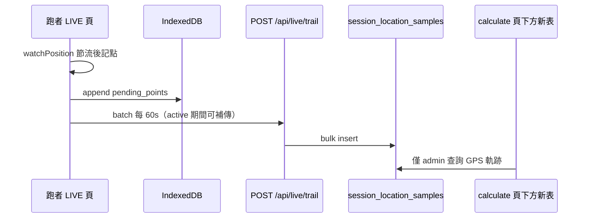

# Phase 1：LIVE 前景軌跡錄製（規劃稿）

> 狀態：**已確認決策，待實作**（2026-05-28）  
> 目的：在 Web 可行範圍內，於 LIVE 活動進行中記錄跑者移動軌跡，供管理後台查看與計算總距離。  
> **不取代** 現有 QR checkpoint 遊戲邏輯，**不修改** passport 顯示與勝負規則。

---

## 0. 已確認決策（產品）

| # | 項目 | 決議 |
|---|------|------|
| 1 | 節流 | 最小移動 **20 m**；批次上傳每 **60 s**（或累積 ≥15 點先到先傳） |
| 2 | 寫入時機 | **管理者結束活動前**（`session.status = active`）皆可寫入／補傳；`closed` 後拒絕。僅 admin 可見，不暴露給 passport／其他跑者 |
| 3 | Admin UI | 在 `/admin/events/[sessionId]/calculate` **既有掃描距離表格下方**，新增**獨立第二張表**（GPS 軌跡），不動上方原有設計 |
| 4 | Wake Lock | **Phase 1 不做**（見 §5.2） |
| 5 | 資料保留 | 原始軌跡點保留 **30 天** 後刪除（cron／手動清理皆可） |
| 6 | GPS 精度 | 軌跡 `watchPosition` **預設 `enableHighAccuracy: true`**（愈準愈好；裝置仍可能降級） |
| 7 | 與掃描距離 | **不並列**「掃描路徑距離」與「GPS 軌跡距離」；上方表維持現狀（掃描點邏輯），下方新表僅呈現 GPS 軌跡 |

---

## 1. 背景與目標

### 1.1 現況

- 掃描 Token 時以 `getCurrentPositionForScan()` **單次**取 GPS，寫入 `tokens.lat` / `tokens.lng`。
- 管理後台「移動距離計算」**上方表格**以 **掃描順序 + checkpoint 預設座標**（無 GPS 時 fallback）計算段距離——**Phase 1 不修改此表**。
- 純 Web 在 **螢幕鎖定 / App 背景** 時無法可靠持續定位（尤其 iOS Safari）。

### 1.2 Phase 1 要做什麼

| 要做 | 不做（留 Phase 2+） |
|------|---------------------|
| LIVE 頁前景時 `watchPosition` 連續取點 | 鎖屏 / 背景持續定位 |
| 本地 IndexedDB 暫存 + 批次上傳 Supabase | Capacitor / 原生 App |
| 新表存軌跡點，與 `tokens` 分離 | 把軌跡寫進 `tokens` |
| calculate 頁**下方**新增 GPS 軌跡表（獨立區塊） | 修改上方掃描距離表、並列兩套總距離 |
| 原始點保留 **30 天** | Realtime 推送每一個 GPS 點 |
| | Passport／LIVE 公開名單顯示軌跡 |
| | Screen Wake Lock |
| | 用軌跡決定遊戲排名 |

### 1.3 成功標準（封測可驗收）

1. 跑者進入 LIVE 且授權定位後，前景 30 分鐘內能於 DB 看到連續（節流後）軌跡點。
2. Admin 在 calculate 頁**下方新表**能看見各跑者軌跡點數、GPS 軌跡總距離（Haversine 累加）。
3. 單場 50 人 × 2 小時，資料庫新增列數在預估範圍內（見 §4），不影響既有掃描流程與上方表格。
4. 活動仍為 active 時，IndexedDB 佇列可補傳；admin 結束活動後不再接受新點。

---

## 2. 技術原則（對應先前五點）

### 2.1 客戶端節流（最重要）

`watchPosition` **沒有** 內建 `distanceFilter`，需在 callback 內自行過濾。

**已確認常數（軌跡專用，與掃描分開）：**

| 參數 | 值 | 說明 |
|------|-----|------|
| `enableHighAccuracy` | **`true`** | 軌跡錄製預設高精度；掃描仍用既有 `getCurrentPositionForScan()`（`false` + 2s timeout） |
| `maximumAge` | `30_000` ms | 允許使用 30 秒內快取位置 |
| `timeout` | `10_000` ms | 比掃描寬鬆 |
| **最小移動距離** | **`20` m** | 位移不足不記點 |
| **批次上傳間隔** | **`60` s** | 或累積 ≥15 點先到先傳 |
| 最小時間間隔（可選） | `30` s | 實作時可選：避免極端情況長時間零點 |
| 最大靜止間隔（可選） | `60` s | 實作時可選：靜止過久仍記 1 點 |

**預估寫入量（50 人、2 小時、20m 節流）：** 約 **3,500～6,500 列/場**。

### 2.2 批次上傳（不要每點一個 HTTP）

- 客戶端 IndexedDB 佇列：`pending_points[]`。
- 觸發上傳：每 **60 秒** 或累積 **≥ 15 點**（先到先傳）。
- API：`POST /api/live/trail`（單次 body 上限例如 50 點）。
- 伺服器：bulk `insert`；`client_point_id` + unique 防重複。

**補傳：** 活動未結束前，失敗佇列持續重試；結束後 API 回 403，客戶端停止上傳（可保留本地佇列但不強制清除）。

### 2.3 伺服器端聚合（Phase 1 輕量）

- Admin 查詢時計算 `total_distance_m`（Haversine 依 `recorded_at` 排序）。
- **30 天**後刪除 `session_location_samples` 中過期列（`created_at` 或 `recorded_at` 擇一，實作時統一）。
- Summary 聚合表（Phase 1.1 可選，非必須）。

### 2.4 索引與約束

```sql
-- 概念 schema（實作時放 supabase/migrations/）
create table session_location_samples (
  id uuid primary key default gen_random_uuid(),
  session_id uuid not null references sessions(id) on delete cascade,
  user_id uuid not null references users(id) on delete cascade,
  recorded_at timestamptz not null,
  lat double precision not null,
  lng double precision not null,
  accuracy_m double precision,
  client_point_id uuid,
  created_at timestamptz not null default now()
);

create unique index session_location_samples_dedupe
  on session_location_samples (session_id, user_id, client_point_id)
  where client_point_id is not null;

create index session_location_samples_session_user_time
  on session_location_samples (session_id, user_id, recorded_at);
```

- 寫入：**僅** `POST /api/live/trail` + service role。
- `sessions` 刪除 → cascade 清軌跡。

### 2.5 與 `tokens` 表分離

| 資料 | 表 | 用途 |
|------|-----|------|
| QR 掃描事件 | `tokens` | 遊戲進度、passport、**上方** calculate 掃描表 |
| 連續軌跡 | `session_location_samples` | **下方** GPS 軌跡表、admin 總里程 |

兩套資料邏輯**不互相依賴**；admin 頁面**分開兩張表**呈現，不並列總距離數字。

---

## 3. 架構概覽



### 3.1 客戶端模組（規劃）

| 檔案（規劃） | 職責 |
|--------------|------|
| `src/hooks/useLiveLocationTrail.ts` | watch、節流、IDB、排程上傳 |
| `src/lib/location-trail-store.ts` | IndexedDB 佇列 |
| `src/lib/location-trail-upload.ts` | `/api/live/trail` |
| `src/app/live/page.tsx` | 掛 hook；簡短狀態（記錄中／已暫停），**無 Wake Lock** |

**生命週期：**

- `enteredRunnerId` + `sessionId` + `userId` 齊備 → 啟動 `watchPosition`（`enableHighAccuracy: true`）。
- `visibilitychange` → hidden 時 pause；visible 時 restart。
- unmount → `clearWatch` + 盡力 flush（僅 session 仍 active 時成功）。
- **不**改動 `performTokenScan`。

### 3.2 API（規劃）

#### `POST /api/live/trail`

**驗證（已確認）：**

- 目標 `sessionId` 須存在且 **`status = 'active'`**（管理者尚未按「結束活動」）。
- 允許上傳**稍早錄製、稍晚送達**的點（補傳），只要活動未結束。
- `userId` / `runnerId` 與該場 `user_sessions` 一致。
- `points.length` ≤ 50；`recorded_at` 合理時間窗。

**Response：** `{ ok: true, inserted: 12, skipped: 0 }`

#### `GET /api/admin/events/[sessionId]/trail`（admin only）

- 供 calculate 頁下方新表：每位跑者 `point_count`、`total_distance_m`、首末點時間。
- 可選：展開單人點列（分頁）。

### 3.3 管理後台 UI（已確認）

**頁面：** `/admin/events/[sessionId]/calculate`

```
┌─────────────────────────────────────┐
│  既有區：依「掃描 Token」的移動距離表   │  ← 不修改、不並列 GPS 數字
│  （掃描時間、Token、掃描定位、採用定位…）│
└─────────────────────────────────────┘
┌─────────────────────────────────────┐
│  新增區：GPS 軌跡（session_location_   │  ← Phase 1 新表
│  samples）                           │
│  Runner | 點數 | 軌跡總距離 | 首末時間 │
│  （可選展開：每點 recorded_at, lat, lng）│
└─────────────────────────────────────┘
```

- **不**在 passport、LIVE 名單、公開 API 暴露軌跡。
- **不**把「掃描路徑總距離」與「GPS 軌跡總距離」放在同一列對照。

---

## 4. 資料量與 Supabase

### 4.1 是否需要另一套 Database？

**不需要。**

### 4.2 容量與保留

- 單場中等規模約 **~15,000 列 / ~3 MB**。
- **保留 30 天**後刪除 raw 點（文件／cron 註明即可）。

### 4.3 與 Realtime

軌跡不走 Realtime。

---

## 5. 隱私、權限、UX

### 5.1 權限文案（規劃）

- 說明：路徑僅供主辦於管理後台查看活動距離，**僅在 LIVE 頁開啟且活動進行中上傳**。
- 不要求 iOS「永遠」定位。

### 5.2 Wake Lock — Phase 1 不做（已確認）

**產品決議：** 暫不實作。

**理由（與討論一致）：**

- 會讓螢幕不易自動休眠，跑者可能察覺（系統也可能顯示相關行為），體驗需額外說明與開關。
- Phase 1 定位是「前景軌跡」；鎖屏仍可能中斷記錄，可於 LIVE 用小字提示「請盡量保持此頁開啟」。
- 若封測回饋鎖屏斷點嚴重，再評估 Phase 2 可選 Wake Lock。

### 5.3 高精度 GPS（已確認）

- 軌跡：`enableHighAccuracy: true`。
- 注意：瀏覽器／OS 仍可能因電量、訊號改為低精度或延遲；可選丟棄 `accuracyM > 80` 的點（實作時常數）。

---

## 6. 實作步驟（待開工）

| 步驟 | 內容 |
|------|------|
| 1 | SQL migration `session_location_samples` |
| 2 | `POST /api/live/trail`（僅 active session）+ db helper |
| 3 | IndexedDB + `useLiveLocationTrail`（20m / 60s / high accuracy） |
| 4 | `live/page.tsx` 整合（無 Wake Lock） |
| 5 | Admin trail API + calculate **頁下方新表** |
| 6 | i18n、錯誤處理、30 天清理說明 |
| 7 | 手動測試（Android Chrome、iOS Safari） |

**明確不做：** 改 passport；改上方掃描表；Wake Lock；Capacitor。

---

## 7. 測試計畫（封測前）

1. 前景 10 分鐘：DB 有節流點；60s 批次成功。
2. 活動仍 active、網路恢復後：IDB 佇列補傳成功。
3. Admin 結束活動後：`POST /api/live/trail` 被拒絕。
4. 無定位權限：可掃 QR；下方 admin 無軌跡。
5. calculate：**上方表與改版前一致**；**下方新表**有 GPS 總距離。
6. 刪 session：軌跡 cascade 刪除。

---

## 8. 風險與緩解

| 風險 | 緩解 |
|------|------|
| iOS 鎖屏停止記錄 | 文案「保持 LIVE 頁開啟」；Phase 1 無 Wake Lock |
| GPS 飄移 | 20m 節流；可選 accuracy 上限 |
| 惡意灌點 | active + user 驗證 + 速率限制 |
| 與掃描表混淆 | **物理分隔兩張表**；標題明確「GPS 軌跡」 |

---

## 9. 關於第 3 點與第 7 點（釐清）

你問的「並列」是指：是否在**同一張表或同一列**同時顯示兩種總距離。

**已確認做法：**

- **第 3 點**：在 calculate 頁**最下方**加**第二張表**（GPS 專用）——這是主要 UI 方案。
- **第 7 點**：**不要**在畫面上把「掃描路徑總距離」和「GPS 軌跡總距離」並排對照（例如同一列兩個數字）；上方掃描細表維持原樣，下方只顯示 GPS 相關欄位。

兩點一致，不衝突。

---

## 10. 小結

Phase 1 已具備開工條件：**20m + 60s 批次、active 期間可補傳、高精度軌跡、calculate 下方新表、30 天保留、不做 Wake Lock**。  
確認後可依 §6 開始實作。
